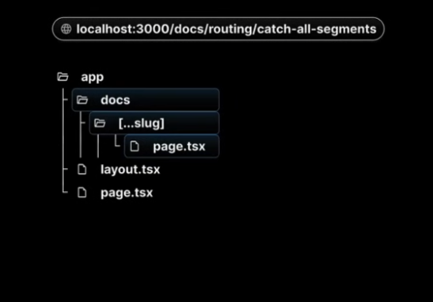

# Introdcution
 ### Why you should learn Next.js? 
 Better routing, api routes, rendering, data fetching, styling, optimization and development & production build system. 
 

# Routing
1. Catch all route
this route captures everything after a certain point 

2. Not found Page 
This page can be made by 
not-found.tsx (this should written as it is, since it's a convention.). It does not

# File Colocation
File colocation in Next.js refers to the practice of organizing all files and logic together within the same route segment, especially within the app directory. This allows developers to keep related components, styles, tests, or helper functions alongside the routes they belong to, without those files automatically becoming publicly accessible routes.

1. Private folder 
eg _lib - The underscore will make the folder private which wont be show on in the url. 
If you reallly want to include the underscore in the url "%5f" before the underscore will make it visible 

2. Route Group 
Add paranthesis to the main folde name, which will act an a medium to club multiple urls 

# Layout 
Consider this as the root of website, where everything is arrange properply 
The Root Layout fucntion is very crucial. Every project built in Next js has a root layout. Even if we delet it, the next js generates it again. 

1. Multiple Root Layout 
2. Nested Root Layout 

These are different ways to put layout giving us more freedom to compute. 

## Routing Metadata 
Metadata is customiasable. The custom meta data doesn't work in use client page. 

